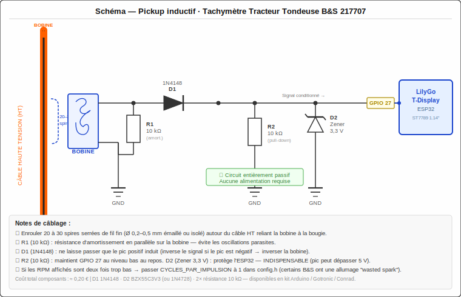

# Tachymètre Tracteur Tondeuse

Tachymètre numérique pour moteur **Briggs & Stratton 217707** (monocylindre 4 temps),
réalisé avec un **LilyGo TTGO T-Display** (ESP32 + écran TFT ST7789 1,14").

Le signal RPM est capté par une **bobine inductive** (quelques spires de fil) enroulée autour du câble haute tension de la bougie — aucun capteur à acheter.

---

## Aperçu de l'affichage

```
┌──────────────────────────────────┐
│         TACHYMETRE               │
│      ╱‾‾‾‾‾‾‾‾‾‾‾‾‾╲            │
│    ╱   ║║║║║║║║║║║   ╲          │
│   │        3450        │   (arc  │
│   │        RPM         │  coloré)│
│    ╲___________________╱         │
│  MIN: 1720       MAX: 3580       │
└──────────────────────────────────┘
```

**Zones de couleur de la jauge :**
| Couleur | Plage RPM | Signification |
|---------|-----------|---------------|
| 🔵 Cyan | < 1 500 | Ralenti / démarrage |
| 🟢 Vert | 1 500 – 3 200 | Fonctionnement normal |
| 🟡 Jaune | 3 200 – 3 600 | Vitesse élevée |
| 🔴 Rouge | > 3 600 | Survitesse |

---

## Matériel requis

| Composant | Référence | Qté |
|-----------|-----------|-----|
| Microcontrôleur + écran | LilyGo TTGO T-Display (ESP32) | 1 |
| Diode de signal | 1N4148 | 1 |
| Diode Zener 3,3 V | BZX55C3V3 ou 1N4728A | 1 |
| Résistance 10 kΩ | 1/4 W | 2 |
| Fil fin pour bobine | Ø 0,2–0,5 mm (émaillé ou isolé) | ~50 cm |

**Coût total composants passifs : ≈ 0,20 €**

---

## Schéma électronique



### Principe de fonctionnement

Le câble haute tension (HT) reliant la bobine d'allumage à la bougie produit un bref pic magnétique à chaque allumage. En enroulant quelques spires de fil autour de ce câble, on crée un **transformateur à air** qui capte ce pic et génère une petite tension induite.

Le circuit de conditionnement (4 composants passifs) :
- **R1 (10 kΩ)** — Résistance d'amortissement en parallèle sur la bobine, évite les oscillations parasites
- **D1 (1N4148)** — Redresse le signal : ne laisse passer que le pic positif
- **R2 (10 kΩ)** — Pull-down : maintient la broche GPIO au niveau bas au repos
- **D2 (Zener 3,3 V)** — Écrête la tension à 3,3 V pour protéger l'ESP32 (**indispensable**, le pic peut dépasser 5 V)

### Fabrication de la bobine

1. Couper ~50 cm de fil fin (Ø 0,2–0,5 mm)
2. Enrouler **20 à 30 spires serrées** autour du câble HT (le gros câble noir entre la bobine et la bougie)
3. Maintenir avec du ruban adhésif ou de la gaine thermorétractable
4. Les deux extrémités du fil constituent les bornes A et B de la bobine

> **Conseil :** Plus de spires = signal plus fort. Si le signal est trop faible, augmenter à 40–50 spires.

---

## Installation logicielle

### Prérequis

- [VS Code](https://code.visualstudio.com/) + extension [PlatformIO](https://platformio.org/)
- ou PlatformIO CLI

### Compilation et flashage

```bash
# Cloner le dépôt
git clone https://github.com/fatom2k/mower-tachometer.git
cd mower-tachometer

# Compiler
pio run

# Flasher (ESP32 connecté en USB)
pio run --target upload

# Moniteur série
pio device monitor
```

---

## Configuration

Tous les paramètres sont dans **`include/config.h`** :

```c
// Broche GPIO du signal pickup
#define PICKUP_PIN             27

// Nombre de cycles moteur par impulsion
// 4 temps : 1 étincelle toutes les 2 révolutions → valeur = 2
// Si RPM affiché = moitié du réel → passer à 1 (wasted spark)
#define CYCLES_PAR_IMPULSION   2

// Plages RPM (adapter selon votre moteur)
#define RPM_MAX_DISPLAY        4500
#define RPM_ZONE_IDLE          1500
#define RPM_ZONE_NORMAL        3200
#define RPM_ZONE_HIGH          3600
```

### Dépannage RPM incorrect

| Symptôme | Cause probable | Solution |
|----------|---------------|----------|
| RPM = moitié du réel | Moteur à allumage "wasted spark" | `CYCLES_PAR_IMPULSION 1` |
| RPM = double du réel | 2 aimants détectés au lieu de 1 | `CYCLES_PAR_IMPULSION 4` |
| Pas de signal | Pic négatif au lieu de positif | Retourner la bobine (inverser A et B) |
| Signal bruité | Trop d'oscillations | Réduire R1 à 4,7 kΩ |

---

## Brochage LilyGo TTGO T-Display

```
LilyGo T-Display          Circuit pickup
─────────────────────     ──────────────
GPIO 27               ←── Signal conditionné (après D1, R2, D2)
3V3                        (non utilisé, circuit passif)
GND               ←──── GND du circuit
```

**Broches écran (configurées automatiquement) :**
`MOSI=19 · SCLK=18 · CS=5 · DC=16 · RST=23 · BL=4`

---

## Architecture du code

```
mower-tachometer/
├── platformio.ini      ← Configuration PlatformIO + TFT_eSPI
├── include/
│   └── config.h        ← Tous les paramètres réglables
├── src/
│   └── main.cpp        ← Firmware principal
└── docs/
    └── schematic.svg   ← Schéma électronique
```

**Fonctionnement interne :**
- La broche GPIO 27 est configurée en interruption (`RISING`)
- L'ISR mesure le temps entre deux impulsions successives (`micros()`)
- Filtre anti-rebond : intervalle minimum de 20 ms (≈ 6 000 RPM max)
- Calcul : `RPM = (60 000 000 × CYCLES_PAR_IMPULSION) / intervalle_µs`
- Affichage par sprite (double buffer) → pas de scintillement, 10 Hz

---

## Licence

Projet personnel open-source — libre d'utilisation et de modification.
